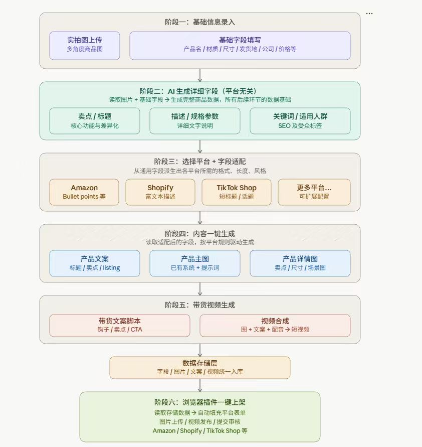

# product-ai-listing-studio

[](LICENSE)
[](https://www.python.org/)
[](https://streamlit.io/)
[](https://www.remotion.dev/)

AI product listing and cross-border ecommerce content studio for turning product photos and basic product facts into marketplace-ready listing data, selling copy, AI-generated product visuals, and short video assets.

`product-ai-listing-studio` is designed for ecommerce operators, cross-border sellers, marketplace agencies, and AI content builders who need a repeatable pipeline for Amazon, Shopify, TikTok Shop, Pinduoduo/PDD, and other product publishing workflows.

## Workflow



The project follows a staged product-content pipeline:

1. **Basic information input**: upload real product photos and fill product name, material, size, shipping origin, company, price, and other source fields.
2. **AI product detail enrichment**: analyze product images and source fields to generate selling points, titles, descriptions, specs, keywords, SEO tags, and target-audience notes.
3. **Platform field mapping**: adapt universal product data into marketplace-specific structures such as Amazon bullet points, Shopify rich descriptions, TikTok Shop short titles, and PDD category fields.
4. **One-click content generation**: generate product copy, main images, detail images, listing text, and scene-based product descriptions.
5. **Selling-video generation**: create short selling scripts and connect image/video generation workflows for product promotion assets.
6. **Storage and publishing preparation**: keep fields, images, copy, and video materials ready for browser-plugin publishing or manual marketplace upload.

## Features

- Streamlit-based product listing workspace.
- Product field schema, SKU matrix helpers, and listing persistence utilities.
- AI-assisted product title, selling point, description, specification, keyword, and SEO generation.
- Vision analysis for uploaded product photos.
- Marketplace field mapping examples, including PDD category mapping data.
- Coze workflow hooks for product main images, detail images, and selling videos.
- Yunwu / GRS-style image and video generation wrappers.
- Remotion template project for product video composition.
- Local-first output strategy: generated media, local drafts, and runtime data are ignored by Git by default.

## Use Cases

- Generate Amazon listing bullet points and SEO keywords from product images.
- Create Shopify product descriptions and visual selling points.
- Prepare TikTok Shop short titles, hooks, and product-video scripts.
- Build PDD product fields from structured product data.
- Turn product photos into main images, detail images, and short selling videos.
- Prototype browser-plugin based marketplace publishing workflows.

## Repository Layout

```text
app.py                  Main Streamlit app
llm.py                  LLM and vision-call wrapper
ziduan.py               Product data model and SKU helpers
prompt.py               Product enrichment prompts
prompt_pdd.py           PDD listing prompt and mapping helpers
prompt_video.py         Selling-video prompt helpers
listing.py              Local product/listing persistence
image_gen.py            Image generation helpers
video_gen.py            Video generation helpers
coze_workflow.py        Generic Coze workflow driver
cozedaihuo.py           Selling-video Coze workflow wrapper
platform_maps/          Platform field mapping examples
re/my-video/            Remotion product-video template
docs/assets/            Public README assets
```

## Quick Start

```powershell
python -m venv .venv
.\.venv\Scripts\Activate.ps1
pip install -r requirements.txt
Copy-Item .env.example .env
streamlit run app.py
```

For the Remotion video template:

```powershell
cd re/my-video
npm install
npm run dev
```

## Configuration

Copy `.env.example` to `.env` and fill only the services you plan to use.

```env
YUNWU_API_KEY=
GRSAI_API_KEY=
PT_IMAGE_RELAY_BASE_URL=
PT_IMAGE_RELAY_URL=
COZE_TOKEN=
COZE_MIHE_KEY=
COZE_WORKFLOW_ZHUTU_ID=
COZE_WORKFLOW_XIANGXITU_ID=
COZE_WORKFLOW_XIANGXITU2_ID=
COZE_WORKFLOW_VIDEO_ID=
```

The open-source version intentionally does not include private API keys, Coze PATs, workflow IDs, image relay servers, generated images, videos, or local output data.

## GitHub Topics

Recommended repository topics:

`ai-ecommerce`, `product-listing`, `cross-border-ecommerce`, `marketplace-automation`, `product-copywriting`, `image-generation`, `video-generation`, `streamlit`, `remotion`, `coze-workflow`, `tiktok-shop`, `shopify`, `amazon-listing`, `pdd`, `sku-generator`, `seo-keywords`

## Keywords

AI ecommerce, product listing, cross-border ecommerce, marketplace automation, product copywriting, AI product description, AI product photography, product image generation, product video generation, listing optimizer, Amazon listing, Shopify product description, TikTok Shop listing, Pinduoduo listing, PDD listing, SKU generator, SEO keywords, product content pipeline, Coze workflow, Remotion video, Streamlit app.

中文关键词：AI 电商、商品上架、跨境电商、商品文案、商品详情页、AI 生成主图、AI 生成详情图、带货视频、商品视频生成、上架字段映射、SKU 矩阵、Amazon Listing、Shopify 商品描述、TikTok Shop、拼多多上架、PDD 上架、SEO 关键词、商品内容自动化、浏览器插件一键上架。

## Security Notice

This repository was prepared for public release by moving provider tokens, workflow IDs, and private relay URLs into environment variables. Any key that existed in local source files before publication should be treated as compromised and rotated at the provider.

## License

MIT
